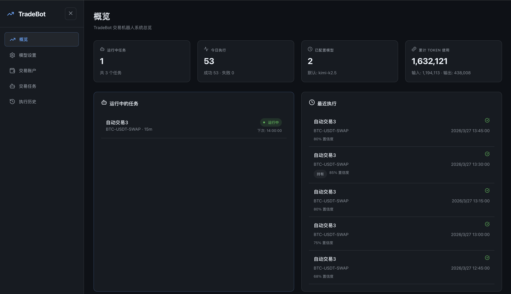
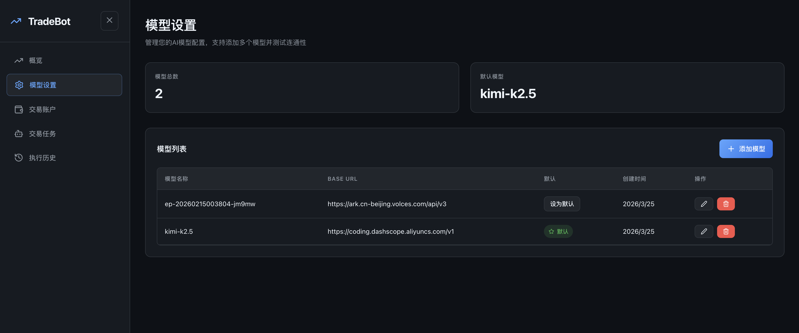
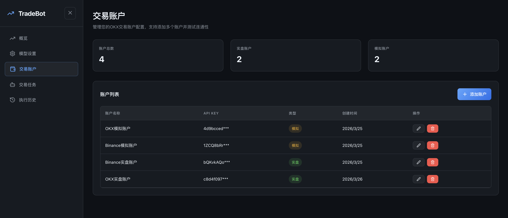
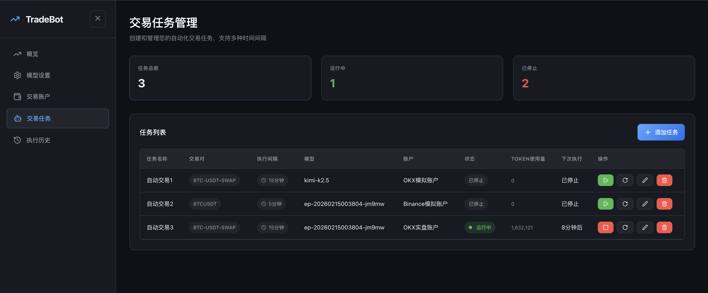
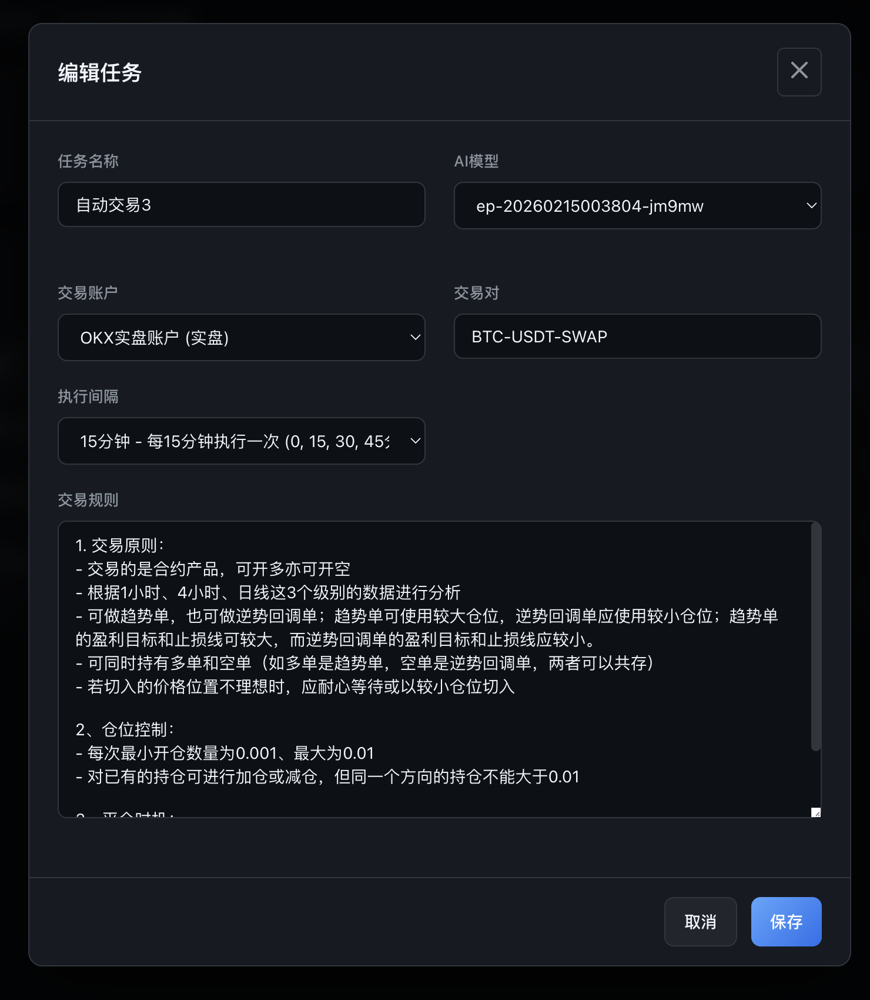
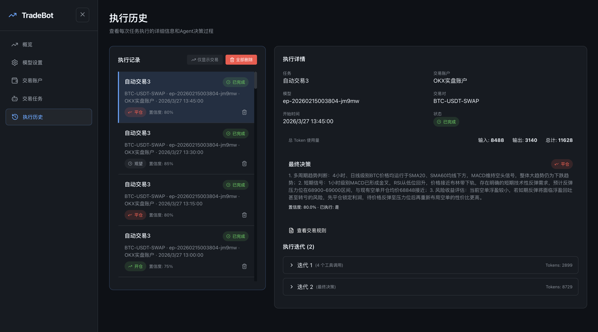
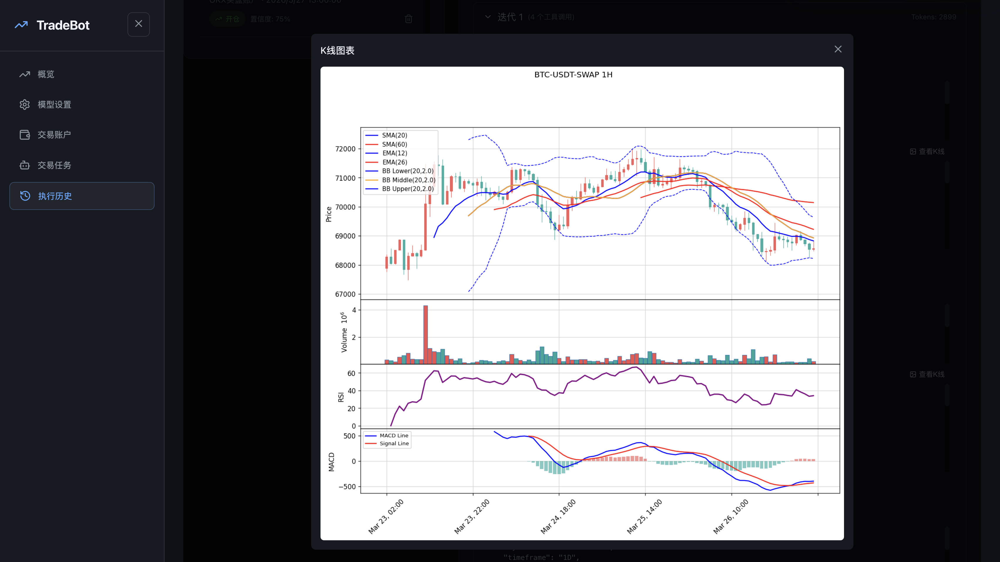

# CryptoAgent - AI 数字货币交易助手

<p align="center">
  
</p>

## 背景与目的

### 传统量化的痛点

在没有 AI 模型支持 之前，传统量化交易存在以下问题：
- 一些视觉化且主观性的交易规则难以程序标准化
- 例如：头肩顶形态、筑底迹象、盘整比较久、布林带收窄走平等形态识别
- 需要编写大量代码来实现这些规则，且难以快速验证和迭代

### 我们的解决方案

随着 AI 模型能力的快速迭代，特别是**多模态能力**（视觉理解）的出现，让我们可以：

- 使用**自然语言编写交易规则**，无需懂得编程
- Agent 根据交易规则**自行调用工具**完成任务
- 通过修改交易规则，即可快速验证新的交易策略，无需重新编写复杂的量化程序代码
注：本项目必须在支持视觉理解的 AI 模型上运行，如国产的Doubao-Seed-2.0-pro，Qwen-3.5-Plus。

### 核心特性

- 🤖 **自然语言交易规则** - 用日常语言描述你的交易策略
- 👁️ **K线图表理解** - Agent 能够读取并分析 K 线图表（需要支持视觉的模型）
- 📊 **内置工具集** - 提供行情数据、图表生成、账户管理等工具
- ⏰ **定时自动执行** - 支持多种时间间隔的自动交易
- 📱 **Web 管理界面** - 直观的可视化管理

> ⚠️ **当前版本限制**：
> - 目前仅支持**永续合约**交易
> - 目前仅支持**现价开仓**和**现价平仓**操作，挂单、止盈止损等更多交易操作待开发

### K线图表技术指标

Agent 在分析 K 线图表时支持以下技术指标（可在交易规则中指定使用以下哪些指标）：

| 类型 | 指标 |
|------|------|
| 移动平均线 | SMA, EMA |
| 趋势指标 | ADX, Aroon |
| 动量指标 | RSI, MACD, KDJ, Stochastic, CCI, Williams %R |
| 波动率指标 | ATR, Bollinger Bands (BBands) |
| 成交量指标 | OBV, VWAP, MFI |

### 支持的交易所

| 交易所 | 实盘 | 模拟盘 | 状态 |
|--------|------|--------|------|
| OKX | ✅ | ✅ | 已支持 |
| Binance | ✅ | ✅ | 已支持 |
| Bybit | ⏳ | ⏳ | 待开发 |

> � 如果这个项目对你有帮助，欢迎在 GitHub 点星支持！星数越多，我们将更有动力开发更多交易所对接。

## 系统架构

本项目采用前后端分离架构：

- **API 服务** (端口 8000): Web API，管理任务、账户、模型配置
- **Agent 服务** (端口 8001): 执行交易任务，定时调度
- **前端**: React + TypeScript，用户界面

## 快速开始

### 环境要求

- Python 3.13+
- Node.js 18+
- tmux 或 screen（用于后台运行服务）

### 安装步骤

```bash
# 1. 克隆项目
git clone https://github.com/osulivan/CryptoAgent.git
cd CryptoAgent

# 2. 一键安装
./install.sh
```

### 配置

1. 复制环境变量文件（可选，用于代理等）：
```bash
cp .env.example .env
```

2. 在 Web 界面中配置：
- **交易账户 API 密钥**：进入「账户设置」页面添加
- **AI 模型 API 密钥**：进入「模型设置」页面添加

### 启动服务

```bash
./start.sh
```

服务启动后访问 **http://localhost:5173**

## 使用指南

### 1. 配置 AI 模型

<p align="center">
  
</p>

> ⚠️ **重要**: 必须使用具有**图片理解能力**的模型（如 GPT-4V、Claude Vision、Moonshot K2.5 、Doubao-Seed-2.0-pro、Qwen-3.5-Plus 等），因为 Agent 需要读取 K 线图表。

进入「模型设置」页：
- 点击「添加模型」
- 输入模型名称、Base URL、API Key
- 点击「测试连通性」验证模型是否成功连接
- 设为默认模型（可选）

### 2. 添加交易账户

<p align="center">
  
</p>

进入「交易账户」页：
- 点击「添加账户」
- 选择交易所、填写 API Key、API Secret
- 选择实盘或模拟交易
- 点击「测试连通性」验证账户是否成功连接

### 3. 创建交易任务

<p align="center">
  
</p>

<p align="center">
  
</p>

进入「交易任务」页：
- 点击「添加任务」
- 选择交易账户和 AI 模型
- 设置交易品种（如 BTC-USDT-SWAP）
- **编写交易规则**（用自然语言描述）
- 选择执行间隔

### 4. 查看执行历史

<p align="center">
  
</p>

<p align="center">
  
</p>

进入「执行历史」页：
- 查看每次执行的详细信息
- 查看 Agent 的决策过程和工具调用日志
- 分析交易结果和 Token 消耗

## 项目结构

```
CryptoAgent/
├── src/
│   ├── web/           # API 服务
│   ├── agent/         # AI Agent 核心逻辑
│   ├── agent_service/ # Agent 服务（调度器、执行器）
│   ├── exchange/      # 交易所接口
│   ├── chart/        # K线图生成
│   ├── llm/          # LLM 适配器
│   └── shared/       # 共享代码
├── frontend/         # React 前端
├── data/             # JSON 数据存储
├── img/              # 项目截图
├── start.sh          # 启动脚本
├── stop.sh           # 停止脚本
└── install.sh        # 安装脚本
```

## 技术栈

- **后端**: Python, FastAPI, APScheduler, aiohttp
- **前端**: React, TypeScript, React Query
- **AI**: OpenAI Compatible API (支持多模态的模型)
- **交易所**: OKX, Binance

## 未来展望

如果这个项目受到大家的欢迎（收获大量 GitHub ⭐），我们将持续扩展更多功能：

- 🌍 **更多交易所支持** - 如Bybit、Bitget等更多主流交易所
- 💎 **现货交易** - 支持现货市场的自动交易
- 📝 **更多交易操作** - 支持设置/修改挂单、止盈止损、风控参数等
- 📢 **交易通知** - 支持 Telegram、飞书、钉钉等消息推送，实时通知交易状态
- 📊 **更丰富的图表分析** - K线图表支持更多技术指标
- 📈 **消息面分析** - 提供消息面工具供Agent 分析市场情绪
- 🎯 **策略回测** - 支持基于历史数据回测交易策略

---

## 免责声明

本项目仅供学习和研究使用，实盘交易存在风险，请谨慎使用。
